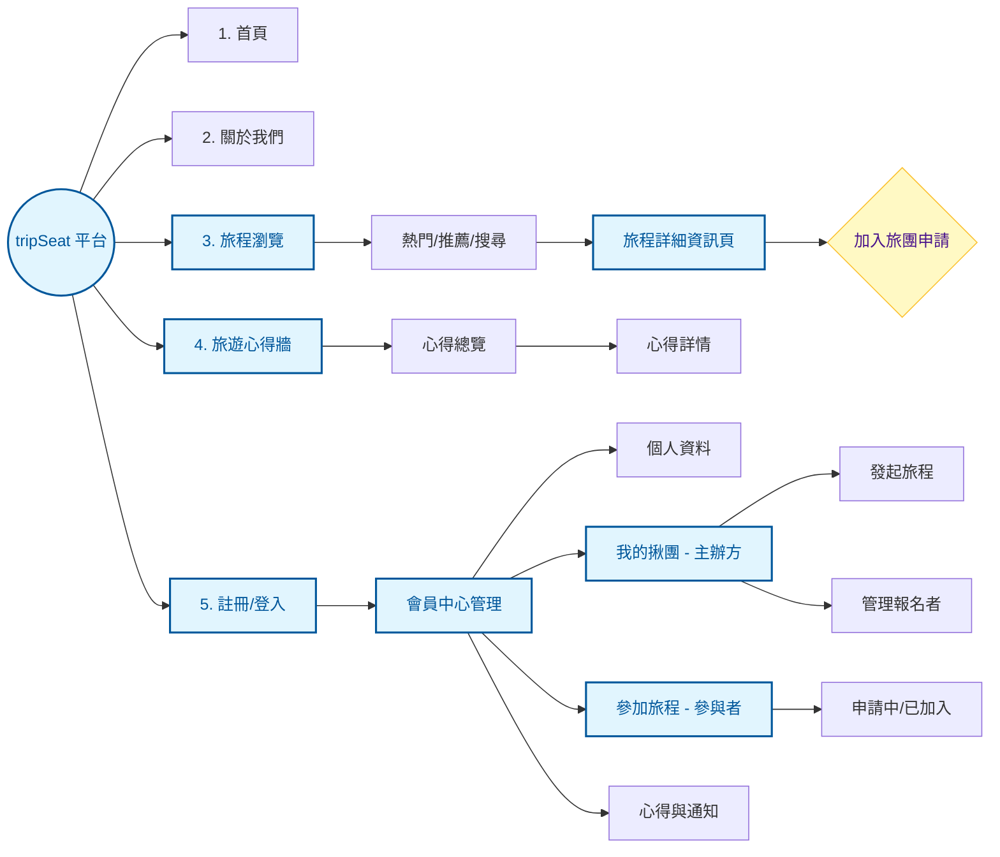

# tripSeat 網站詳細地圖 (Sitemap v2)

為了讓你更直覺地理解網站架構，我將原本的圖表進行了優化，並新增了「資料夾清單」式的導覽。

## 📍 1. 視覺化架構圖 (系統化地圖)

---

## 📂 2. 網站目錄清單 (階層式地圖)

這是像檔案夾一樣的排版，讓你清楚每一頁的父子關係：

### 🏠 外部公共區 (訪客與會員皆可見)

- **1. 首頁 (Home)**：平台入口
- **2. 關於我們 (About)**：介紹與規範
- **3. 旅程探索 (Exploration)**
  - 熱門旅程列表
  - 推薦旅程列表
  - 搜尋結果頁
  - 📄 **旅程詳細資訊頁** (這是核心頁面！)
    - 📝 填寫加入申請表 (需登入)
- **4. 旅遊心得牆 (Review Wall)**
  - 心得總覽列表
  - 📄 **心得文章詳情**

### 🔐 私人管理區 (登入後可見)

- **5. 註冊/登入**
- **6. 會員中心 (Dashboard)**
  - 🛠 **個人資料設定**
  - 🚩 **我的揪團 (主辦領域)**
    - ➕ 發起新旅程
    - 📋 我發起的旅程列表
      - 🔍 旅程管理 (編輯/取消)
      - 👥 報名名單審核 (接受/拒絕申請者)
  - 👟 **參加旅程 (參與領域)**
    - ⏳ 申請中旅程列表
    - ✅ 已確認加入之旅程
      - 📢 查看同行者聯絡資訊
  - 📩 **互動與紀錄**
    - 我的心得紀錄 (撰寫/編輯)
    - 系統通知與聊天訊息
    - 平台使用評價 (Feedbacks)

---

### 💡 Antigravity 的規劃建議

- **色彩區核**：在視覺圖表中，**藍色**代表核心導覽，**黃色**代表動作(Action)，**白色**代表一般頁面。
- **管理邏輯**：我特別將會員中心拆分成「主辦」與「參加」，這會對應到我們 API 的權限設計，讓後端邏輯更直覺。
- **下一步建議**：我們可以從「**旅程詳細資訊頁**」開始討論，因為它連接了瀏覽、報名、行程顯示等多項核心數據。
